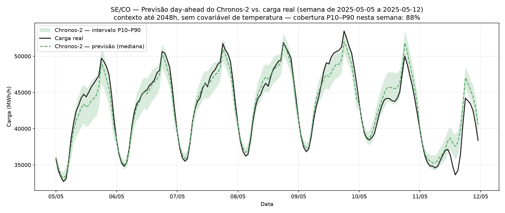

# Cutting the Cost of Electricity Forecast Error by 65%

Day-ahead hourly load forecasting for Brazil's largest grid region — where a zero-shot foundation model beat tuned classical baselines and cut the modeled cost of forecast error from R\$8.5bn to R\$3.0bn.



*Chronos-2 day-ahead forecast vs. actual load, test week (May 2025), with the P10–P90 uncertainty band.*

## The problem

Brazil's grid operator schedules generation a day in advance. Under-forecast demand and expensive thermal reserves must be dispatched at short notice; over-forecast and committed capacity is wasted. The error has an hourly price, set by the marginal cost of operation (CMO). This project asks two questions: how accurately can day-ahead hourly load be forecast for the Southeast/Center-West (SE/CO) subsystem — and does better accuracy actually translate into lower dispatch cost?

## Key results

- **Forecast error cut to about a third of the baseline** — MASE 0.44 vs. 1.27, MAPE 1.82% vs. 5.37%, on a held-out temporal test split.
- **Modeled dispatch cost of error fell ~65%** — R\$8.52bn → R\$3.01bn over ~2.5 years, achieved zero-shot on a laptop CPU with no training.
- **Ranking by accuracy ≠ ranking by cost** — two models swap places between the two metrics, because ~25% of cost concentrates in the top 10% of price hours. Optimizing the standard statistical metric would select the costlier model.
- **Uncertainty bands are trustworthy** — 88.9% empirical coverage at a 90% nominal interval, usable for sizing a reserve margin.

## Business impact

In stakeholder terms: over the test window, moving from the industry-standard naïve baseline to the foundation model corresponds to roughly **R\$5.5bn less in the modeled cost of getting tomorrow's demand wrong** — and the improvement lands disproportionately in the expensive hours, where it matters most. The cost figure is a transparent estimate (each hour's error priced at that hour's official marginal generation cost), not audited operator accounting; the assumption is stated explicitly in the report.

## Data

Eleven years of official open data: **ONS hourly load** for SE/CO (2015-01-01 → 2026-07-15, ~101k hourly observations, CC-BY), **ONS semi-hourly CMO** dispatch price, and **Open-Meteo day-ahead forecast temperature** for five capitals (CC BY 4.0). No bulk data is committed — the repo ships `data/raw/MANIFEST.json` (URLs + SHA-256), so the exact snapshot is reconstructible. Full provenance, dictionary, and caveats: [`docs/DATA_CARD.md`](docs/DATA_CARD.md).

## Approach

**Data** → verified against a SHA-256 manifest (ONS revises history retrospectively) → **cleaning** → text-to-float coercion with round-trip checks, gaps kept as NaN rather than imputed, 9 daylight-saving-transition timestamps flagged and excluded as forecast origins → **features** → calendar and lags, all ≥24h so every feature is computable at the forecast origin → **method** → a ladder of proof: seasonal-naïve baseline, then SARIMA and Prophet (which estimate structure locally), then Chronos-2 zero-shot → **evaluation** → walk-forward, day-ahead, sliding origin over 2024-01-01+, **never shuffled**, test touched once, with a per-feature leakage self-test.

## Repo structure

```
.
├── run_all.py              # single entry point (staged)
├── requirements.txt        # pinned dependencies
├── src/                    # pipeline, models, plots
├── data/
│   ├── raw/MANIFEST.json   # URLs + SHA-256 (data itself not committed)
│   └── processed/          # cleaned series, features, saved predictions
├── notebooks/1.0-forecasting-comparativo.ipynb
├── reports/
│   ├── FACTS.md            # canonical numbers, generated by code
│   ├── figures/            # 8 result charts
│   ├── tabela_comparativa.csv
│   ├── tabela_custo_assimetrico.csv
│   └── tabela_vies_direcional.csv
├── docs/                   # DATA_CARD, MODEL_CARD, SETUP, technical_report
└── references/one_pager.md
```

## How to run

```bash
git clone https://github.com/MateusFPavan/ons-carga-eda.git && cd ons-carga-eda
python -m venv .venv && source .venv/bin/activate   # Windows: .venv\Scripts\activate
pip install -r requirements.txt

python run_all.py            # reproduces the result in ~1.5 min from saved predictions
python run_all.py --help     # all stages and their cost
```

Retraining is optional and explicit (`--stage models --yes`, ~4h) — reproducing the *result* does not require it. Full detail: [`docs/SETUP.md`](docs/SETUP.md).

## Tech stack

`Python` · `pandas` · `NumPy` · `PyTorch` · `Chronos-2` · `statsmodels (SARIMA)` · `Prophet` · `matplotlib` · `pyarrow` · `Time-Series Forecasting` · `Walk-Forward Validation` · `Data Leakage Prevention` · `Reproducible Pipelines`

## Limitations & next steps

The cost metric is a declared model, not realized dispatch cost, and depends on a CMO timezone inferred from evidence rather than documented by ONS. "Zero-shot" means not fine-tuned here — pretraining contamination cannot be excluded from public documentation. Temperature uses five capitals for a subsystem covering ~a third of Brazil, and only day-ahead was validated. Next: serialize fitted models, strengthen the cost proxy toward merit-order dispatch, and serve the validated model behind an API as a separate project.

## Docs

[Technical report](docs/technical_report.md) · [Model card](docs/MODEL_CARD.md) · [Data card](docs/DATA_CARD.md) · [Setup](docs/SETUP.md) · [One-pager](references/one_pager.md)

## License & contact

MIT License — see [LICENSE](LICENSE).

**Mateus Fardin Pavan** · [mateusfardinpavan@gmail.com](mailto:mateusfardinpavan@gmail.com) · [LinkedIn](https://www.linkedin.com/in/mateus-fardin-pavan) · [GitHub](https://github.com/MateusFPavan)

---

### Final self-check — MUST-HAVE items

Present: outcome-oriented title, problem statement, hero visual, key results with headline number, run instructions with pinned deps and relative paths, repo structure.

No result numbers were invented.
